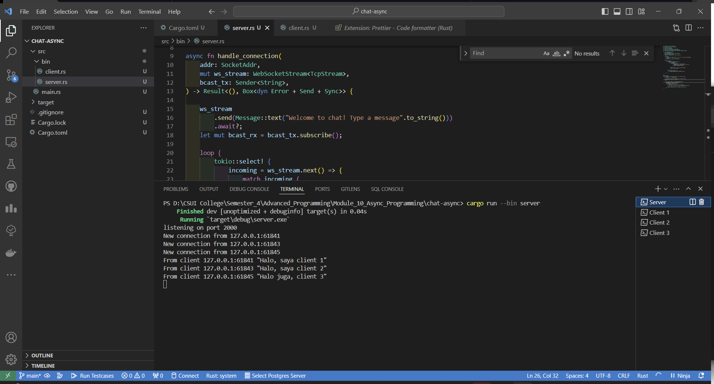
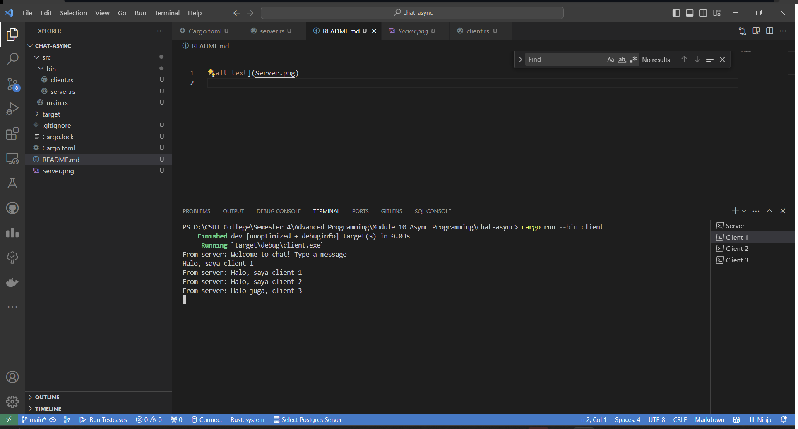
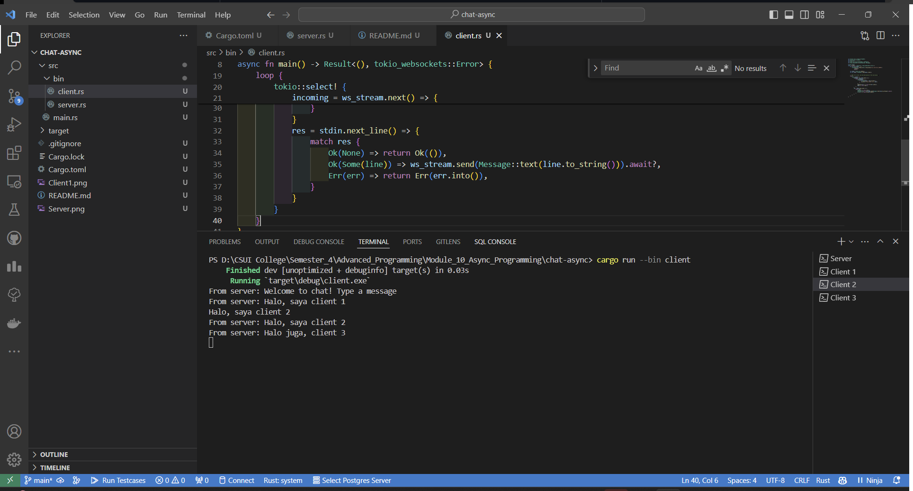
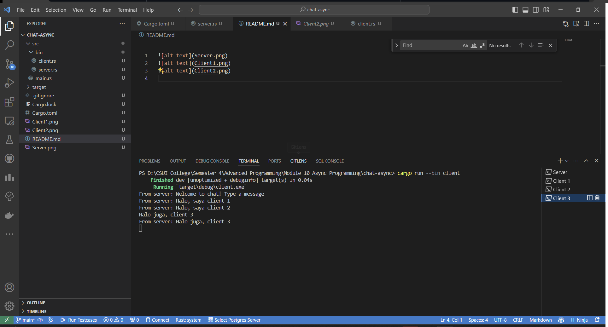

## Tutorial 2 Module 10


### 2.1 Original code of broadcast chat
#### Server

#### Client 1

#### Client 2

#### Client 3


Pertama, perlu ditambahkan konfigurasi baru pada cargo.toml
```toml
[[bin]]
name = "server"

[[bin]]
name = "client"
```

Hal ini ditujukan agar cargo dapat mengenali dua buah file yang akan dijalankan.

Untuk menjadlankan server, jalankan perintah berikut:
```bash
cargo run --bin server
```

Untuk menjalankan client, jalankan perintah berikut:
```bash
cargo run --bin client
```

Terlihat dalam gambar bahwa setiap kali client mengirimkan pesan, pesan tersebut akan diterima oleh server dan disebarkan ke semua client yang terhubung. Ini merupakan konsep dasar dari broadcast chat yang telah diaplikasikan pada beberapa aplikasi2 chat yang ada saat ini.

### 2.2 Modifying the websocket port

Beberapa bagian kode yang perlu ubah ketika port number ingin diubah adalah pada bagian berikut:

#### Server.rs
`let listener = TcpListener::bind("127.0.0.1:2000").await?;`
diubah menjadi
`let listener = TcpListener::bind("127.0.0.1:8080").await?;`

dan 

#### Client.rs
`ClientBuilder::from_uri(Uri::from_static("ws://127.0.0.1:2000"))`
diubah menjadi
`ClientBuilder::from_uri(Uri::from_static("ws://127.0.0.1:8080"))`

Websocket protocol merpakan protokol komunikasi antara client dan server. Sehingga keduanya harus menggunakan port yang sama agar dapat berkomunikasi. Sehingga ketika port yang ada pada client.rs akan diubah, maka port yang ada pada server.rs juga harus diubah.